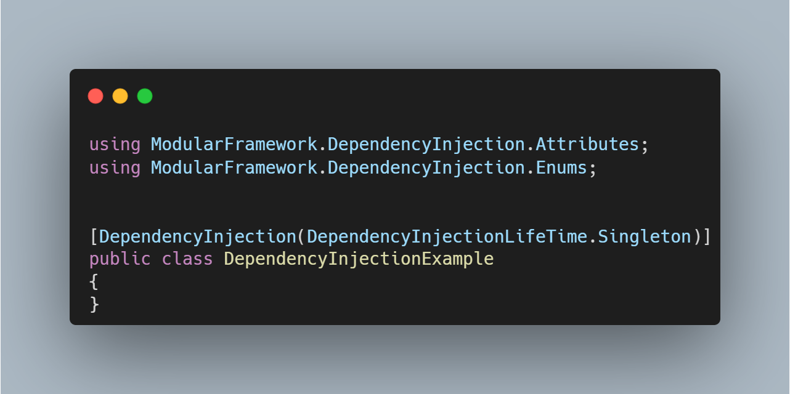
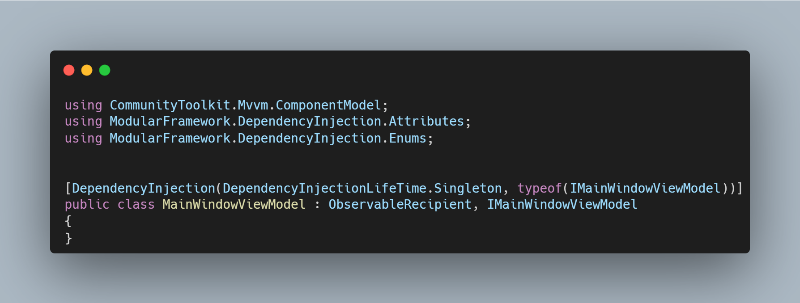
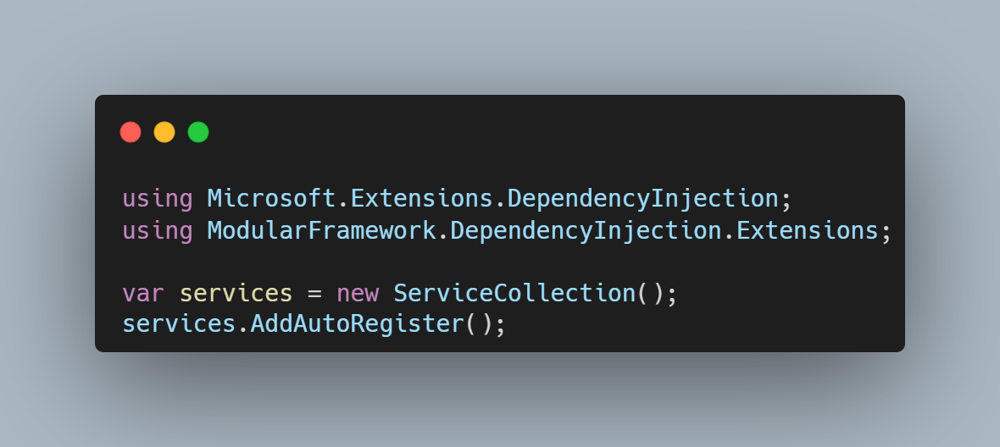

# ModularFramework.DependencyInjection

어트리뷰트 기반으로 서비스 등록을 자동화하는 의존성 주입 모듈입니다.

---

## 📌 개요

ModularFramework.DependencyInjection은  
런타임 어셈블리 스캔을 통해 어트리뷰트가 선언된 클래스를 자동으로 탐색하고  
DI 컨테이너에 등록하는 기능을 제공합니다.

---

## ⚙ 주요 특징

- 어트리뷰트 기반 DI 등록
- 수동 Service 등록 코드 제거
- 런타임 어셈블리 스캔
- ServiceLifetime 자동 적용

---

## 🚀 사용 방법

### 1. ViewModel 또는 Service에 어트리뷰트 선언

#### 1) 인터페이스 미포함

#### 2) 인터페이스 포함

### 2. 서비스 등록
